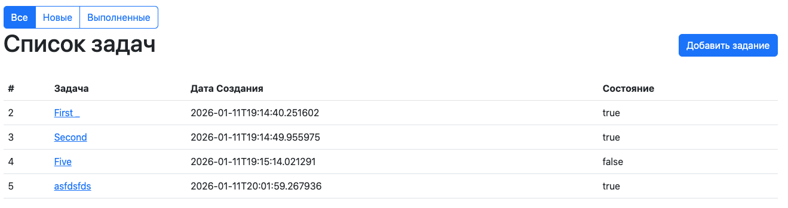
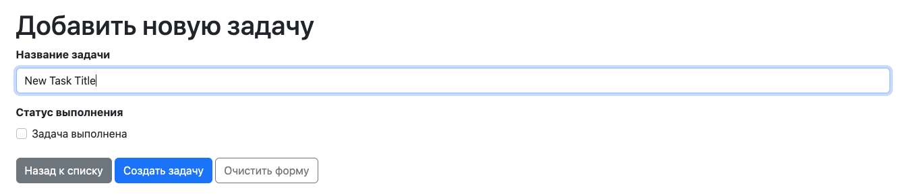
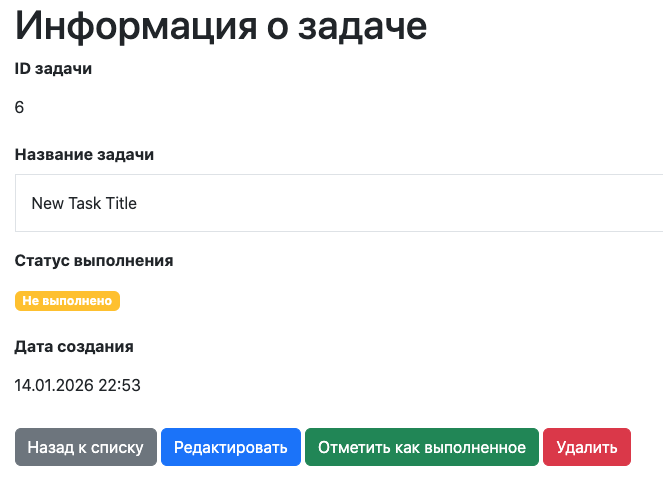

**job4j_todo**

Pet project on job4j course.

ToDo list application with pages for: 
-Registration/Login 
-Add tasks and set statuses 
-Set completion status 
-Edit tasks 
-Filtering tasks with completion status 

**Stack:**
Java 17, SpringBoot 2.7.6, Thymeleaf, Bootstrap,
Maven 4.0.0, Liquibase 4.15.0, Hibernet 5.6.11
PostgreSQL 42.2.9

**Requirements:**
Java 17, SpringBoot 2.7.6, Thymeleaf, Bootstrap,
Maven 4.0.0, Liquibase 4.15.0, Hibernet 5.6.11
PostgreSQL 42.2.9

**Installation** 
-Create database todo 
-Maven Install  
-Run Main class 

**Usage** 
Start page is the list of created task with status filter 

 
New Task Creation 

 
Task edit and status set up 

 

**Contact:**
s.eilseev1@gmail.com